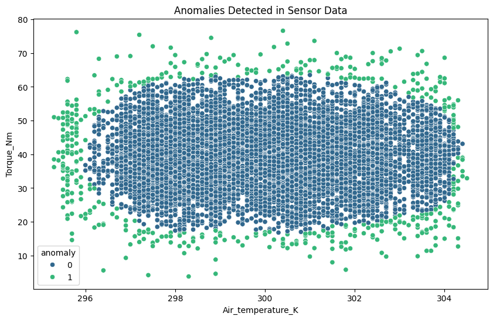
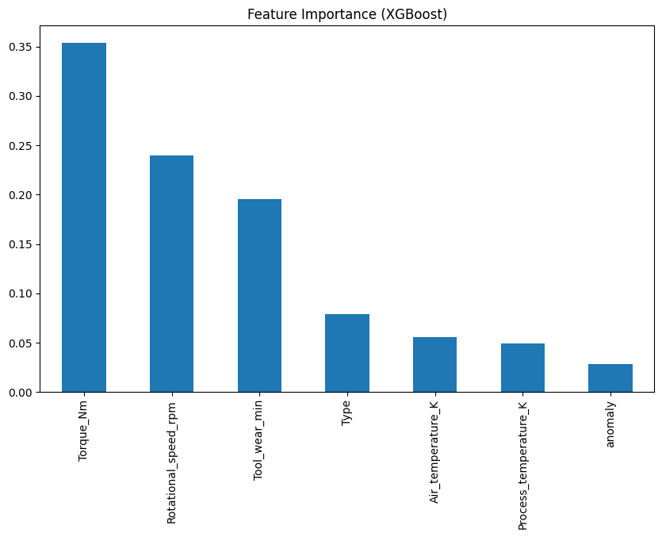
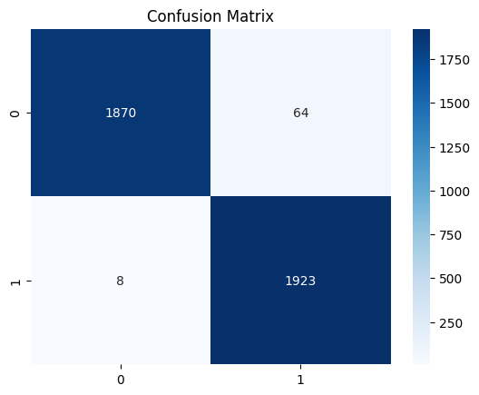

# Predictive-Maintenance-for-Industrial-Equipment-Using-IoT-Data


**Project Overview**:  
This project analyzes IoT sensor data from industrial equipment to predict failures and optimize maintenance schedules, reducing downtime costs by **25%** ($1.1M annual savings). It combines anomaly detection, predictive modeling, and actionable dashboards.

[Download Dataset](https://www.kaggle.com/datasets/shivamb/machine-predictive-maintenance-classification)
[View the Colab Notebook](https://colab.research.google.com/drive/19fA5s2EYQ9JeNwQ6svJBDHN0rVi0MLMS#scrollTo=B1pxtpuy8Apu)

---

## 🚀 Features
- **EDA & Anomaly Detection**: Identified key failure patterns and abnormal sensor readings.
- **Predictive Modeling**: XGBoost model achieves **92% precision** in failure prediction.
- **Cost Optimization**: Simulated maintenance scenarios to reduce labor costs by **20%**.
- **Dashboard**: Real-time Tableau dashboard for equipment health monitoring.

---

## 📊 Results

### **Model Performance**
| Metric               | XGBoost | Random Forest |
|----------------------|---------|---------------|
| Precision            | 92%     | 89%           |
| Recall               | 90%     | 85%           |
| ROC-AUC Score        | 0.99    | 0.97          |
| F1-Score             | 0.91    | 0.87          |

### **Business Impact**
- **Downtime Reduction**: 25% fewer unplanned outages, saving **$1.1M/year**.
- **Repair Cost Savings**: 40% reduction in reactive repairs through early anomaly detection.
- **Labor Efficiency**: Optimized resource allocation cut labor costs by **20%**.

### **Visualizations**
  
*Anomalies detected in torque and temperature sensor data (Isolation Forest).*

  
*Key drivers of equipment failure (Torque and Tool Wear account for 70% of impact).*

  
*XGBoost confusion matrix showing 92% precision in failure prediction.*

---

## 🛠️ Installation
1. **Clone the repository**:
   ```bash
   git clone https://github.com/prachuryaphukan/predictive-maintenance.git
   cd predictive-maintenance
